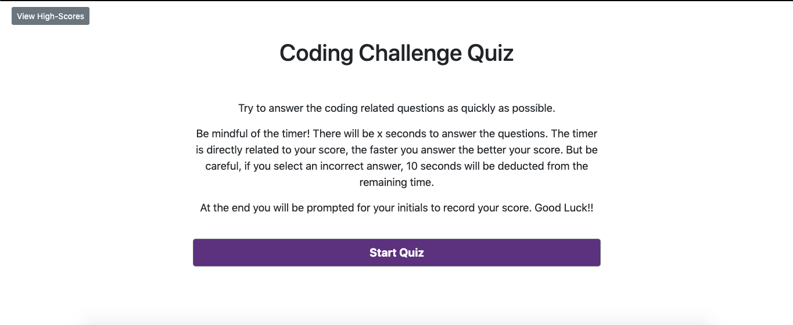

# Coding Quiz Challenge (Homework #4)

## How it Works (*should work*)

Try to answer the coding related questions as quickly as possible.
There will be x seconds to answer the questions. The timer is directly related to your score the faster you answer the better your score. But be careful, if you select an incorrect answer, 10 seconds will be deducted from the remaining time.
At the end you will be prompted for your initials to record your score.

## Preview 

